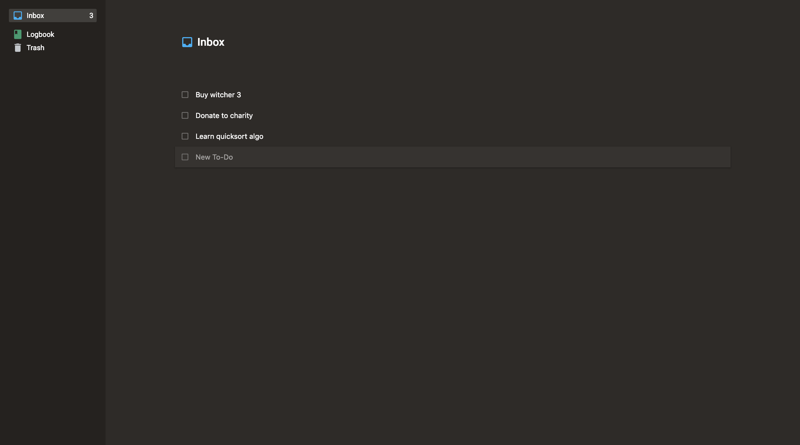

# To-Do List App ✅

Yet another personal task manager. 😀

Made with latest and greatest vanilla js features.

Heavily inspired by [Things 3](https://culturedcode.com/things).

## Assets

- [Roboto font](https://fonts.google.com/specimen/Roboto)

## License

This project is licensed under the MIT License - see the [LICENSE](LICENSE) file for details.
